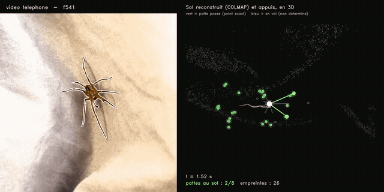
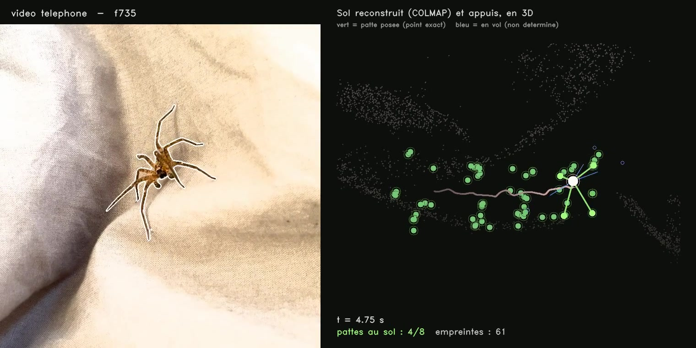
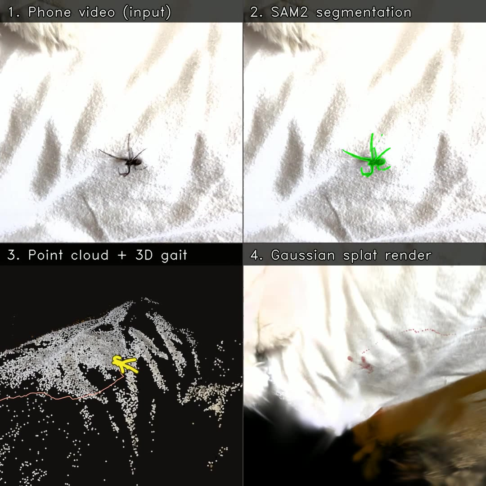

# Markerless footfall capture from a single phone camera

> Where does a spider actually put its feet? Measured from handheld phone video —
> no markers, no force plate, no motion-capture rig.

*Left: input video, animal segmented. Right: the ground reconstructed by
photogrammetry, seen in 3D. **Green** = a foot planted on the surface, its
position determined exactly. **Blue** = a leg in flight, undetermined. Green
discs are footfalls accumulating over time; the pink line is the body's path.*

---

## The idea

A walking spider deforms between viewpoints, so it cannot be triangulated across
frames — the usual multi-view machinery gives nothing. **The ground it walks on
does not deform.**

So this pipeline reconstructs the *scene* instead of the animal, masking the
animal out of feature matching. That gives camera pose and a ground plane from
ordinary video, and makes one quantity exact rather than estimated:

> A planted foot lies on the ground plane. Its 3D position is therefore the
> intersection of its optical ray with that plane — closed form, no fitting, no
> depth ambiguity.

A foot in flight does not lie on the plane and is not determined. So the central
question stops being *where are the legs* and becomes **which feet are planted**.

A planted foot is identified by being **fixed in the world** — not fixed
relative to the body, which is a different and much weaker statement, and
getting those two confused invalidated an earlier result.

---

## The pipeline

| Stage | Method |
|---|---|
| Scene reconstruction | COLMAP sparse SfM, features masked inside the animal |
| Segmentation | SAM2, sparse hand annotation propagated through the take |
| Ground plane | one plane per take, IRLS with Tukey weights |
| Appendage tips | geodesic distance from the body core, local maxima, angular grouping |
| Leg identity | anchored on the abdomen via geodesic diameter, named by cyclic order |
| Contacts | world-fixity criterion, validated against a shuffled-identity control |

**Stack** — Python, COLMAP / pycolmap, SAM2, PyTorch, OpenCV, NumPy / SciPy,
ffmpeg. Techniques: structure-from-motion, morphological geodesics, robust
estimation, permutation testing.

Full method, with the measurement behind every parameter: **[METHOD.md](METHOD.md)**

### Code

[`src/leg_tips.py`](src/leg_tips.py) and [`src/leg_labels.py`](src/leg_labels.py)
are the core of the method, published in full and depending on nothing but
OpenCV and NumPy. Tip detection by geodesic propagation inside the mask, then
naming by cyclic order around the body.

They are worth opening for the docstrings as much as the code: every constant
states the measurement that set it, and both modules document the approaches
that were tried and refuted before the current one — three different body-axis
anchors, and an azimuth-matching scheme that disagreed with itself on 26 % of
consecutive frames.

---

## Measured results

| | |
|---|---|
| COLMAP registration | 100/100, 51/51, 170/170 images; reprojection **0.99–1.19 px** |
| Second species, **zero code changes** | 43/43 images, 0.74 px, 16 386 scene points |
| Frames yielding all 8 leg tips | **80 %** over a full 33 s take |
| Leg naming stability | **0 label jumps over 712 transitions** (vs 26 % for azimuth matching) |
| Footfalls extracted | 131, median stance 200 ms, 4.21 feet down on average |
| Tip detection | **14× faster** after cropping before the geodesic pass (4.65 s → 0.333 s/frame) |

Each number comes from a control designed to be able to fail. Eight hypotheses
were tested and refuted this way, and are therefore absent from the pipeline —
including three different body-axis anchors and a leg-chaining scheme that
scored *p* = 0.915 against a permuted control.

## Corpus

Twenty-six takes shot on a phone across five surfaces and two species, 3.3 GB.
10 577 frames extracted, 575 bounding boxes annotated by hand. Twelve
reconstructions converged; the contact chain currently runs on three.

Not published here — available on reasonable request for research use.

---

## What is not solved yet

**No independent ground truth**, so no error bars. Every control is internal.
This is the next piece of work and it gates everything else: a synthetic
sequence with known contacts, then a two-camera stereo reference.

**The contact threshold is chosen, not derived.** The statistic's distribution is
unimodal — there is no valley to cut at — so the operating point was selected by
where it placed the duty factor. Defensible engineering, not a measurement.

**One foot in ten is occluded longer than a stance lasts.** Two legs close in
image angle merge into one branch of the mask. Measured: 20 % of frames are
incomplete, in 68 episodes of median 4 frames but with a maximum of 28, against
a median stance of 12. Those losses are **not random with respect to gait
phase**, because legs cross at particular moments of the cycle — so they bias
any gait statistic computed today. Short episodes close rigorously via the
contact criterion itself; the long tail needs a second viewpoint, because the
information is not in the frame and a prior would guess where a camera would
measure.

Also open: rolling shutter unquantified, metric scale run on only one species,
one individual per species so no biological claim is made.

---

## Where this is going

The contacts are not the destination — they are the anchor that makes the rest
solvable. The next stage recovers the **skeleton bottom-up**: from a foot whose
3D position is known exactly, back up the limb to the joint angles.

This is better conditioned than the template fit that was tried first, for a
specific reason. That fit was blind along the viewing axis — a leg stretched
toward the camera projects short, falls inside the mask, and satisfies the cost
function while sitting at an impossible 3D position (measured reach: 4.46 body
radii). Anchoring the tip in depth removes that failure mode **by
construction** rather than bounding it.

The geometry works out. The limb base is known on the body, the tip is known in
3D, segment lengths come from morphology. For a three-segment chain that leaves
one degree of freedom — the elbow circle, as for a human arm. What removes it is
that the whole limb is visible: the chain must project onto the observed medial
axis. Two hard 3D constraints plus a dense image constraint turn an
underdetermined inverse-kinematics problem into a well-posed one.

Implementation: differentiable forward kinematics with a reprojection loss, so
joint angles come out with a gradient rather than from an iterative solver. The
machinery is largely in place — FABRIK under length constraints, species-driven
chain definitions, IK validated to 1e-16.

**The limit is the same one as everywhere else in this project.** A swinging leg
has no 3D anchor at its tip, so depth blindness returns intact for exactly those
limbs. The recovered skeleton would be measured during stance — around 55 % of
leg-frames — and estimated during swing. Stance is measured; flight is inferred.

---

## About

Personal research project, ongoing. Built from scratch — acquisition, pipeline,
validation, and a decision record of every refutation.

The **video corpus** and the **full decision record** are not published here.
[METHOD.md](METHOD.md) is the curated account: it gives the method and the
numbers, not the catalogue of what failed.

Contact welcome, particularly on animal locomotion capture, markerless tracking
under occlusion, or legged-robot controllers trained from biological data.
Citation details in `CITATION.cff`.

**Code** (`src/`) — **MIT**, see `LICENSE`. Use it freely; keep the notice.

**Text and figures** (`README.md`, `METHOD.md`, `figures/`) —
**CC BY-NC-SA 4.0**: attribution, non-commercial, share-alike.

The optional Gaussian Splatting visualisation depends on
`graphdeco-inria/gaussian-splatting`, which carries its own non-commercial
research licence.

Copyright © 2026 Hugo Lequy
